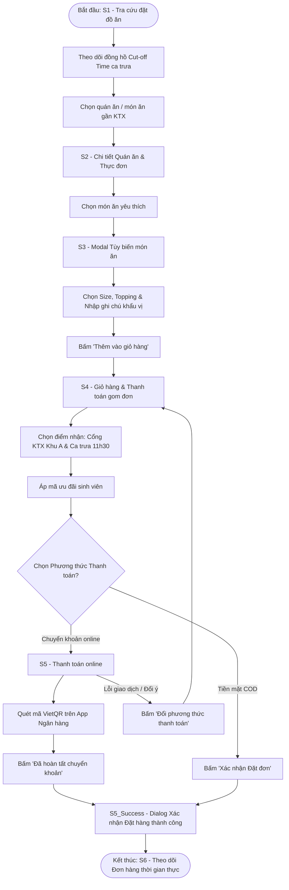
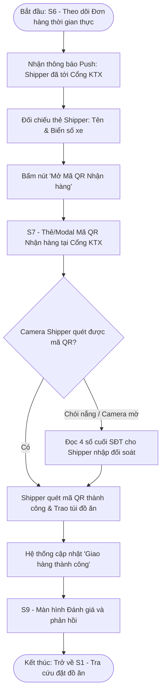
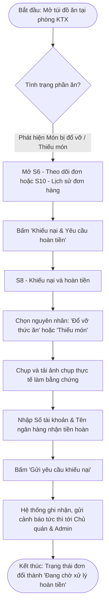

# UX Analysis & User Flow (Food Ordering App - Student Role)

> **Tài liệu tham chiếu:** Bám sát Đặc tả yêu cầu hệ thống `food_ordering_app_srs.md` (Quy trình luồng người dùng mục 4.A) và đồng bộ 100% với hệ thống màn hình thiết kế trên Figma.

---

## 1. Information Architecture (Kiến trúc thông tin & Phân cấp điều hướng)

Hệ thống điều hướng dành cho vai trò Học sinh/Sinh viên được phân cấp thành 2 tầng điều hướng:

### A. Phân cấp điều hướng (Navigation Hierarchy)
* **Khởi tạo & Xác thực (Entry / Authentication):**
  - **S0 (`S0_StudentLogin`)**: Màn hình Đăng nhập / Xác thực sinh viên *(Điểm vào ứng dụng, xác thực SĐT/Email sinh viên ĐHQG)*.

* **Các màn hình Cấp cao nhất (Top-level / Root Screens):** Truy cập trực tiếp qua Bottom Navigation Bar hoặc Header chính của ứng dụng:
  - **S1 (`S1_FoodSearchHome`)**: Tra cứu đặt đồ ăn *(Tab Trang chủ)*.
  - **S6 (`S6_LiveOrderTracking`)**: Theo dõi Đơn hàng thời gian thực *(Tab Đơn hàng đang giao)*.
  - **S10 (`S10_OrderHistory`)**: Lịch sử đơn hàng *(Tab Lịch sử)*.
  - **S11 (`S11_FavoriteList`)**: Danh sách yêu thích *(Tab Quán quen)*.
  - **S12 (`S12_NotificationBoard`)**: Bảng thông báo *(Icon Thông báo trên Header)*.
  - **S13 (`S13_ProfileSettings`)**: Hồ sơ cá nhân / Cài đặt tài khoản *(Tab Tài khoản)*.

* **Các màn hình Lồng bên trong (Nested Screens / Modals / Dialogs):** Kích hoạt theo từng ngữ cảnh tương tác và luồng tác vụ cụ thể:
  - **S2 (`S2_StoreDetailMenu`)**: Chi tiết Quán ăn & Thực đơn *(Mở từ S1 hoặc S11)*.
  - **S3 (`S3_FoodCustomization`)**: Tùy biến món ăn *(Modal mở từ S2)*.
  - **S4 (`S4_GroupCartCheckout`)**: Giỏ hàng & Thanh toán gom đơn *(Mở từ S2 hoặc S1)*.
  - **S5 (`S5_OnlinePayment`)**: Thanh toán online VietQR *(Mở từ S4 khi chọn Chuyển khoản)*.
  - **S5_Success (`S5_OrderSuccessDialog`)**: Dialog Xác nhận Đặt hàng thành công *(Phản hồi tức thì sau S4/S5 trước khi chuyển sang S6)*.
  - **S7 (`S7_PickupQRCode`)**: Mã QR Nhận hàng tại Cổng KTX *(Modal/Thẻ mở từ S6 khi tài xế tới cổng)*.
  - **S8 (`S8_DisputeRefund`)**: Khiếu nại và hoàn tiền *(Mở từ S6 hoặc S10 khi có sự cố đơn)*.
  - **S9 (`S9_ReviewFeedback`)**: Đánh giá và phản hồi *(Mở từ S6 sau khi nhận món hoặc từ S10)*.

---

### B. Danh mục Chi tiết các Màn hình & Dialog Figma của Vai trò Sinh viên
1. **S0 - Màn hình Đăng nhập / Xác thực sinh viên (`S0_StudentLogin`)**: Đăng nhập bằng SĐT/mật khẩu hoặc OTP, xác thực email sinh viên `@vnuhcm.edu.vn` để nhận ưu đãi nội trú KTX.
2. **S1 - Tra cứu đặt đồ ăn (`S1_FoodSearchHome`)**: Khám phá quán ăn quanh KTX ĐHQG, lọc theo KTX Khu A / Khu B / Làng ĐH, xem đồng hồ đếm ngược giờ chốt ca gom đơn (*Cut-off Time*).
3. **S2 - Chi tiết Quán ăn & Thực đơn (`S2_StoreDetailMenu`)**: Xem danh mục món, giá bán, điểm đánh giá sao, bảng tin thông báo từ chủ quán và nút lưu quán yêu thích.
4. **S3 - Tùy biến món ăn (`S3_FoodCustomization`)**: Tùy chọn kích cỡ (Size), mức cay/ngọt, topping thêm và nhập ghi chú khẩu vị riêng (ví dụ: ít cay, không hành).
5. **S4 - Giỏ hàng & Thanh toán gom đơn (`S4_GroupCartCheckout`)**: Chọn địa điểm nhận cố định (Cổng KTX Khu A / Cổng KTX Khu B), chọn ca nhận (Ca trưa 11h30 / Ca tối 18h00), áp mã giảm giá và chọn phương thức thanh toán.
6. **S5 - Thanh toán online (`S5_OnlinePayment`)**: Cung cấp mã VietQR động chứa chính xác số tiền và cú pháp đơn hàng để chuyển khoản trực tiếp cho quán ăn.
7. **S5_Success - Dialog Xác nhận Đặt hàng thành công (`S5_OrderSuccessDialog`)**: Pop-up/Dialog chúc mừng đặt đơn thành công, hiển thị mã đơn hàng `#KTX...` và nút điều hướng xem lộ trình.
8. **S6 - Theo dõi Đơn hàng thời gian thực (`S6_LiveOrderTracking`)**: Hiển thị tiến trình trực tiếp (`Đang nấu` $\rightarrow$ `Đang gom chuyến` $\rightarrow$ `Đang đến cổng KTX`), thẻ thông tin shipper và đếm ngược thời gian đến cổng.
9. **S7 - Mã QR Nhận hàng tại Cổng KTX (`S7_PickupQRCode`)**: Hiển thị mã QR nhận hàng kèm 4 số cuối SĐT để shipper quét/đối soát nhanh tại cổng KTX đông đúc.
10. **S8 - Khiếu nại và hoàn tiền (`S8_DisputeRefund`)**: Biểu mẫu báo cáo sự cố (thiếu món, thức ăn đổ vỡ), đính kèm ảnh bằng chứng và nhập STK nhận tiền hoàn.
11. **S9 - Đánh giá và phản hồi (`S9_ReviewFeedback`)**: Biểu mẫu chấm điểm 1–5 sao và nhận xét chi tiết cho Quán ăn và Shipper sau bữa ăn.
12. **S10 - Lịch sử đơn hàng (`S10_OrderHistory`)**: Tra cứu toàn bộ các đơn hàng đã đặt (Đang phục vụ, Hoàn tất, Đã hủy) kèm tính năng "Đặt lại đơn này".
13. **S11 - Danh sách yêu thích (`S11_FavoriteList`)**: Danh sách các quán ăn quen thuộc được sinh viên đánh dấu yêu thích để đặt lại nhanh chóng.
14. **S12 - Bảng thông báo (`S12_NotificationBoard`)**: Cập nhật thông báo hệ thống, thông báo trạng thái đơn hàng, nhắc nhở sắp hết giờ chốt ca (*Cut-off Time*).
15. **S13 - Hồ sơ cá nhân / Cài đặt tài khoản (`S13_ProfileSettings`)**: Quản lý thông tin sinh viên, tòa nhà KTX đang lưu trú, số tài khoản ngân hàng mặc định nhận tiền hoàn, đổi mật khẩu và đăng xuất.

---

## 2. Chi tiết 3 User Flows (Sơ đồ Mermaid)

*(Bám sát quy trình chuẩn hóa từ Mục 4.A của `food_ordering_app_srs.md`)*

### Flow 1: Khám phá, Đặt món & Thanh toán gom đơn ca trưa (Happy Path & Alternative Path)
* **Điểm bắt đầu (Start Point)**: Màn hình Tra cứu đặt đồ ăn (`S1_FoodSearchHome`).
* **Mục tiêu (Goal)**: Đặt thành công món ăn yêu thích trước đồng hồ Cut-off time ca trưa, nhận phản hồi xác nhận đơn thành công.
* **Điểm kết thúc (End Point)**: Màn hình Theo dõi Đơn hàng thời gian thực (`S6_LiveOrderTracking`).
* **Nhánh thành công (Happy Path)**: Tra cứu món $\rightarrow$ Chọn quán $\rightarrow$ Tùy biến món & ghi chú $\rightarrow$ Thêm vào giỏ $\rightarrow$ Chọn Cổng KTX Khu A & ca trưa 11h30 $\rightarrow$ Áp mã giảm giá $\rightarrow$ Thanh toán online VietQR thành công $\rightarrow$ Hiển thị Dialog Xác nhận Đặt hàng thành công $\rightarrow$ Chuyển tới Theo dõi Đơn hàng thời gian thực.
* **Nhánh thay thế (Alternative Path)**: Tại bước Thanh toán online, nếu ứng dụng ngân hàng bị lỗi kết nối hoặc tài khoản không đủ tiền, sinh viên bấm "Quay lại đổi phương thức", chuyển sang "Tiền mặt khi nhận hàng (COD)" $\rightarrow$ Bấm "Xác nhận đặt đơn" $\rightarrow$ Hiển thị Dialog Xác nhận Đặt hàng thành công $\rightarrow$ Chuyển tới Theo dõi đơn hàng.

---

### Flow 2: Theo dõi Đơn hàng & Quét Mã QR Nhận hàng tại Cổng KTX (Fulfillment & Delivery Flow)
* **Điểm bắt đầu (Start Point)**: Nhận thông báo Push tự động "Shipper đã tới Cổng KTX" / Mở Màn hình Theo dõi Đơn hàng thời gian thực (`S6_LiveOrderTracking`).
* **Mục tiêu (Goal)**: Nhận đúng phần đồ ăn từ shipper giữa đám đông tại cổng KTX trong dưới 20 giây và gửi đánh giá dịch vụ.
* **Điểm kết thúc (End Point)**: Màn hình Đánh giá và phản hồi (`S9_ReviewFeedback`) và trở về Tra cứu đặt đồ ăn (`S1`).
* **Nhánh thành công (Happy Path)**: Xem thẻ shipper (Tên, Biển số xe) $\rightarrow$ Xuống cổng KTX và bấm "Mở Mã QR Nhận hàng" $\rightarrow$ Đưa shipper quét camera $\rightarrow$ Quét thành công, nhận túi đồ ăn $\rightarrow$ Đơn chuyển sang "Đã giao thành công" $\rightarrow$ Mở Màn hình Đánh giá và phản hồi.
* **Nhánh thay thế (Alternative Path)**: Nếu màn hình điện thoại bị trầy xước/chói nắng khiến camera shipper không quét được mã QR, sinh viên đọc "4 số cuối SĐT" hiển thị ngay dưới mã QR để shipper đối soát thủ công trên ứng dụng tài xế.

---

### Flow 3: Phát hiện sự cố Đồ ăn & Yêu cầu Hoàn tiền (Error & Recovery Path)
* **Điểm bắt đầu (Start Point)**: Sinh viên mở túi đồ ăn tại phòng KTX, phát hiện món ăn bị đổ tràn bao bì hoặc quán làm thiếu món/sai ghi chú.
* **Mục tiêu (Goal)**: Gửi hồ sơ khiếu nại thành công kèm ảnh chụp thực tế và số tài khoản ngân hàng để nhận tiền bồi hoàn.
* **Điểm kết thúc (End Point)**: Màn hình Theo dõi Đơn hàng (`S6`) / Lịch sử đơn hàng (`S10`) cập nhật trạng thái "Đang xử lý hoàn tiền".
* **Nhánh lỗi (Error Path)**: Phát hiện đồ ăn hư hỏng/thiếu món $\rightarrow$ Mở chi tiết đơn hàng tại `S6` hoặc `S10` $\rightarrow$ Bấm nút "Khiếu nại & Yêu cầu hoàn tiền".
* **Nhánh phục hồi (Recovery Path)**: Tại màn hình `S8` $\rightarrow$ Chọn loại sự cố (Đổ vỡ / Giao thiếu món) $\rightarrow$ Chụp và đính kèm ảnh bằng chứng $\rightarrow$ Nhập Số tài khoản & Tên ngân hàng nhận hoàn tiền $\rightarrow$ Bấm "Gửi yêu cầu khiếu nại" $\rightarrow$ Hệ thống ghi nhận và cảnh báo tới Chủ quán/Admin để giải quyết bồi hoàn.

---

## 3. Bảng Ánh xạ Flow sang Màn hình (Flow-to-Screen Mapping Table)

Bảng đối chiếu toàn bộ các màn hình và dialog trên Figma với 3 User Flows chính, chứng minh tính đồng bộ và độ phủ màn hình:

| Mã Màn hình | Tên Màn hình (Khớp chính xác Figma) | Flow 1 (Đặt món & Thanh toán) | Flow 2 (Nhận hàng tại Cổng) | Flow 3 (Báo lỗi & Hoàn tiền) | Vai trò bổ trợ trong hệ thống |
| :--- | :--- | :---: | :---: | :---: | :--- |
| **S0** | **Đăng nhập / Xác thực sinh viên** | | | | Xác thực định danh & phân luồng KTX |
| **S1** | **Tra cứu đặt đồ ăn** | **X** *(Bắt đầu)* | **X** *(Kết thúc)* | | Khám phá quán ăn & lọc ca nhận |
| **S2** | **Chi tiết Quán ăn & Thực đơn** | **X** | | | Xem menu & bảng tin thông báo quán |
| **S3** | **Tùy biến món ăn** | **X** | | | Tùy chọn kích cỡ, topping, ghi chú vị |
| **S4** | **Giỏ hàng & Thanh toán gom đơn** | **X** | | | Chọn điểm cổng KTX, ca nhận, mã giảm giá |
| **S5** | **Thanh toán online** | **X** | | | Quét VietQR động chính xác số tiền |
| **S5_Success** | **Dialog Xác nhận Đặt hàng thành công** | **X** | | | Phản hồi xác nhận đặt đơn tức thì |
| **S6** | **Theo dõi Đơn hàng thời gian thực** | **X** *(Kết thúc)* | **X** *(Bắt đầu)* | **X** | Theo dõi tiến trình & mở nhận hàng/khiếu nại |
| **S7** | **Mã QR Nhận hàng tại Cổng KTX** | | **X** | | Đối soát nhận hàng nhanh với shipper |
| **S8** | **Khiếu nại và hoàn tiền** | | | **X** *(Phục hồi)* | Biểu mẫu giải quyết sự cố đơn hàng |
| **S9** | **Đánh giá và phản hồi** | | **X** *(Kết thúc)* | | Chấm điểm sao cho Quán ăn và Shipper |
| **S10** | **Lịch sử đơn hàng** | | | **X** | Tra cứu đơn cũ, đặt lại hoặc khởi tạo khiếu nại |
| **S11** | **Danh sách yêu thích** | | | | Lưu quán quen để đặt lại nhanh |
| **S12** | **Bảng thông báo** | | | | Cập nhật thông báo hệ thống & Cut-off time |
| **S13** | **Hồ sơ cá nhân / Cài đặt tài khoản** | | | | Quản lý thông tin KTX, STK hoàn tiền mặc định |
